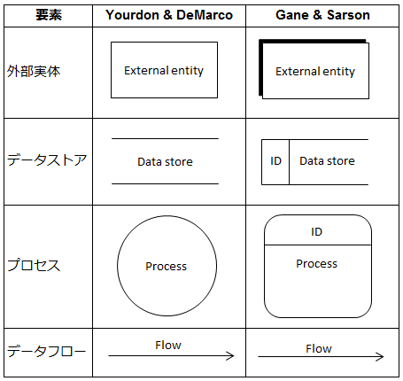

  <small>
  Wacker #21
  </small>

 

# いまさらDOAでDB設計をやってみる

 

 Yohei Taniguchi 

  <small>
    Wacker
  </small>

---

## 今日の目的  

- DOAの設計手法を経験しつつ、今の手法に通じる考え方を学ぶ
- 狭義のS/W設計を体験する

---

## 今日使うツール・資料  

- [draw.io](https://www.draw.io/)
- 今日の関連資料: https://goo.gl/XJPgE1
  - ハンズオン用データ

---

## DOAとは  

--

### 概要  

- DOA = Oriented Approach (データ指向)
  - データと処理を分離した設計アプローチ

--

- 背景
  - コンピュータ利用が複雑な計算・演算処理を主とした利用から、データの蓄積へとシフトしていく
  - 開発規模の大規模化から新たな開発手法が提言される
  - 構造化設計の考え方も広がっていく

- S/Wアーキテクチャの変遷
  - SA:スタンドアローン
  - C/S:クラサバ　→　データと処理＋画面
  - 三層: DB,App,Web → データ、処理、画面

---

## DB設計（論理） 

---

### モデリング  

---

### DFD(Data Flow Dialog) 

- 動的表現を行うモデリング
- プロセス、データのI/O、データソースの抽出
- プロセスのデータの流れを明確にする。
- プロセス分岐の判断条件は表現しない。

--

#### 要素 

参考:http://itref.fc2web.com/technology/dfd.html

--

#### 要素 

- 外部実体=データの発生源。ユーザやシステム
- データストア=データの格納先。DBや帳票など
- プロセス=データの処理。業務や作業
- データフロー=データの流れ

--

#### DFD記述例 

参考:http://itref.fc2web.com/technology/dfd.html

--

#### DFDを書く際に気を付けること 

- プロセスには入出力がある。
- 外部実体とデータストアはプロセスと結びける。(=外部実体とデータストアはデータフローで結ばない。)
- プロセス→外部実体→データストアの順で明確にしていく。
- 外部実体がどのデータストアを利用するか明確にしていく。

--

### ERD 

- Entity-Relationship Diagram
- 静的表現、データのエンティティー定義、リレーション定義

--

#### 要素 

- エンティティー：実体。データモデル
- リレーション：エンティティー間の関係性
- カーディナリティー（多重度）：関係性の数的な表現

---

## DB設計（物理） 

- DBに実装するテーブル設計を行う。
- 論理モデルで抽出したエンティティ、リレーションを踏まえて具体的な項目設計を進める。
  - 正規化
  - テーブル・項目定義:型、長さ、制約

---

### 正規化 

- 一意性の確保
- 冗長性の排除

--

####  第一正規形 

- 主キーの設定
- 繰返し部分の分離

--

#### 第二正規形 

- 重複データの排除

--

#### 第三正規形 

- マスターデータの分離

---

## ハンズオン課題 

--

### 例題1：正規化

使用資料：ハンズオン用データ-正規化.xlsx

- 社員マスターを正規化する
- ERDを書く

--

### 例題2：業務フロー

使用資料：ハンズオン用データ-業務フロー.xlsx

- 業務フロー
  1. 営業が工場に生産を依頼する
  1. 工場で生産オーダーを作る
  1. 工場で製品の組立加工をする
  1. 工場で中間製品、完成品を在庫管理する。
  1. 工場から顧客宛に製品を出荷する

- 課題
  - DFDを書く
  - ERDを書く
  - 帳票から正規化しERDに反映する。
